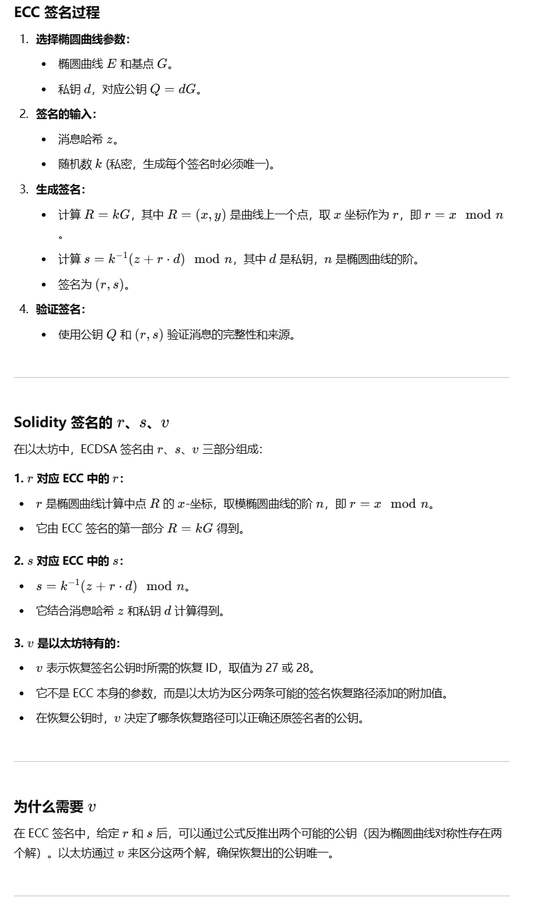

# 中心化风险

## 多签钱包 
参考链接：https://github.com/AmazingAng/WTF-Solidity/blob/main/50_MultisigWallet/readme.md

## ABIEncode
https://github.com/AmazingAng/WTF-Solidity/blob/main/27_ABIEncode/readme.md

## 椭圆取消加密算法

- https://wumansgy.github.io/2018/10/30/%E6%A4%AD%E5%9C%86%E6%9B%B2%E7%BA%BF%E5%8A%A0%E5%AF%86%E7%AE%97%E6%B3%95%E8%AF%A6%E8%A7%A3/

- https://xz.aliyun.com/t/14039?time__1311=GqAxuDRD0D203GXYqCwx7qqWq%2BzXKeqiQ4D

优先这篇
- https://juejin.cn/post/7263886796756844604

如果将A与-A相加，过A与-A的直线平行于y轴，可以认为直线与椭圆曲线相交于无穷远点。

综上，定义了A+B、2A运算，因此给定椭圆曲线的某一点G，可以求出2G、3G（即G + 2G）、4G……。即：当给定G点时，已知x，求xG点并不困难。反之，已知xG点，求x则非常困难。此即为椭圆曲线加密算法背后的数学原理。？？?

### solidity签名过程



## 数字签名
https://github.com/AmazingAng/WTF-Solidity/tree/main/37_Signature

### 数字签名 Signature --- EIP191协议
1、作用：  它可以证明你拥有私钥的同时不需要对外公布私钥。
以太坊使用的数字签名算法叫双椭圆曲线数字签名算法
（ECDSA），基于双椭圆曲线“私钥-公钥”对的数字签名算法。

它主要起到了三个作用：
- 1.身份认证：证明签名方是私钥的持有人。
- 2.不可否认：发送方不能否认发送过这个消息。
- 3.完整性：通过验证针对传输消息生成的数字签名，可以验证消息是否在传输过程中被篡改。

#### keccak256函数
keccak256 是一种哈希函数，用于生成固定长度的哈希值。在以太坊和许多其他区块链中，
keccak256 是一种常见的加密哈希函数。具体来说，它是 SHA-3 家族中的一种实现。

#### 哈希函数的基本概念
哈希函数是一种将任意长度的输入数据转换为固定长度的输出数据的函数。这个输出数据通常称为哈希值或摘要（digest）。

哈希函数有以下几个重要特性：
- 1.固定长度输出：无论输入数据的长度是多少，哈希函数的输出长度都是固定的。
- 2.确定性：相同的输入数据总是会产生相同的输出。
- 3.高效性：计算哈希值的过程是高效的，适合快速计算。

Solidity 内置了  keccak256 函数，可以直接使用它来计算哈希值：
```
// SPDX-License-Identifier: MIT
pragma solidity ^0.8.0;

contract HashExample {
    function hashData(string memory data) public pure returns (bytes32) {
        return keccak256(abi.encodePacked(data));
    }
}
```
在JS中使用：
```
const Web3 = require('web3');
const web3 = new Web3();

const data = "hello world";
const hash = web3.utils.keccak256(data);
console.log(hash); // 0x47173285a8d7347d4f4b6f8ddbf28f2b9b3aa8a4a1b5ff2d72561f9c3f7b2d64
```

#### abi.encodePacked
abi.encodePacked 是 Solidity 中的一种内置函数，用于将多个参数紧凑地编码成一个字节数组。

它与 abi.encode 类似，但不同之处在于 abi.encodePacked 会将输入的数据打包得更紧凑，没有填充字节。紧凑编码可以减少数据的长度，但可能会带来某些风险，如哈希碰撞风险。

具体的示例来理解 abi.encodePacked 的工作方式，以及它与 abi.encode 的区别。
基本用法：
```
// SPDX-License-Identifier: MIT
pragma solidity ^0.8.0;

contract EncodeExample {
    function encodePackedExample(string memory str1, string memory str2) public pure returns (bytes memory) {
        return abi.encodePacked(str1, str2);
    }

    function encodeExample(string memory str1, string memory str2) public pure returns (bytes memory) {
        return abi.encode(str1, str2);
    }
}

区别：
pragma solidity ^0.8.0;

contract EncodeComparison {
    function encodePackedExample(string memory str1, string memory str2) public pure returns (bytes memory) {
        return abi.encodePacked(str1, str2);
    }

    function encodeExample(string memory str1, string memory str2) public pure returns (bytes memory) {
        return abi.encode(str1, str2);
    }

    function compareEncode(string memory str1, string memory str2) public pure returns (bool) {
        return keccak256(abi.encodePacked(str1, str2)) == keccak256(abi.encode(str1, str2));
    }
}
```

假设 str1 是 "hello"，
str2 是 "world"：

encodePackedExample("hello", "world") 可能返回  0x68656c6c6f776f726c64。

encodeExample("hello", "world") 可能返回 
0x000000000000000000000000000000000000000000000000000000000000002068656c6c6f0000000000000000000000000000000000000000000000000000000000000020776f726c640000000000000000000000000000000000000000000000000000000
- abi.encodePacked 返回的字节数组是紧凑的，没有填充字节。
- abi.encode 返回的字节数组包含填充字节，以保证每个参数在字节数组中的固定位置。


### 验证签名

以太坊中的公钥和私钥的生成是基于椭圆曲线加密算法 (Elliptic Curve Cryptography, ECC) 的，所以公钥和私钥是唯一对应的，私钥签名后，用签名生成公钥也是唯一的，就是签名者的账户地址。

实例：

1、现对消息msg使用账户account1进行签名，并且对签名后的数据进行验证。

msg:  0x1bf2c0ce4546651a1a2feb457b39d891a6b83931cc2454434f39961345ac378c

account1:  0xcc66057D1F45Baa018ff415D905aF59989a6C245

2、借助钱包签名：

在网页连接钱包后，在控制台输入如下内容：
```
ethereum.enable()
account = "0xcc66057D1F45Baa018ff415D905aF59989a6C245"
hash = "0x1bf2c0ce4546651a1a2feb457b39d891a6b83931cc2454434f39961345ac378c"
ethereum.request({method: "personal_sign", params: [account, hash]})
```

//注意，在签名的时候，会把hash，在做一次操作：
```
/**
     * @dev 返回 以太坊签名消息
     * `hash`：消息
     * 遵从以太坊签名标准：https://eth.wiki/json-rpc/API#eth_sign[`eth_sign`]
     * 以及`EIP191`:https://eips.ethereum.org/EIPS/eip-191`
     * 添加"\x19Ethereum Signed Message:\n32"字段，防止签名的是可执行交易。
     */
    function toEthSignedMessageHash(bytes32 hash) public pure returns (bytes32) {
        // 哈希的长度为32
        return keccak256(abi.encodePacked("\x19Ethereum Signed Message:\n32", hash));
        //以太坊签名消息: 0xb42ca4636f721c7a331923e764587e98ec577cea1a185f60dfcc14dbb9bd900b
    }
```


最终得到签名后的结果：
0x838de1469eb828a225716703d141ede0edf4bc905fc5ba16a9ec7f11aeb1703164bdd368e9f66d74117b1ef2961c1a668609650d92cc1f93b90059d85988eed01b

### 验证签名：
```
// SPDX-License-Identifier: GPL-3.0

pragma solidity >=0.7.0 <0.9.0;

contract getPublic {

        // @dev 从_msgHash和签名_signature中恢复signer地址
    function recoverSigner(bytes32 _msgHash, bytes memory _signature) public   pure returns (address){
        // 检查签名长度，65是标准r,s,v签名的长度
        require(_signature.length == 65, "invalid signature length");
        bytes32 r;
        bytes32 s;
        uint8 v;
        // 目前只能用assembly (内联汇编)来从签名中获得r,s,v的值
        assembly {
            /*
            前32 bytes存储签名的长度 (动态数组存储规则)
            add(sig, 32) = sig的指针 + 32
            等效为略过signature的前32 bytes
            mload(p) 载入从内存地址p起始的接下来32 bytes数据
            */
            // 读取长度数据后的32 bytes
            r := mload(add(_signature, 0x20))
            // 读取之后的32 bytes
            s := mload(add(_signature, 0x40))
            // 读取最后一个byte
            v := byte(0, mload(add(_signature, 0x60)))
        }
        // 使用ecrecover(全局函数)：利用 msgHash 和 r,s,v 恢复 signer 地址
        return ecrecover(_msgHash, v, r, s);
    }

        /**
     * @dev 通过ECDSA，验证签名地址是否正确，如果正确则返回true
     * _msgHash为消息的hash
     * _signature为签名
     * _signer为签名地址
     */
    function verify(bytes32 _msgHash, bytes memory _signature, address _signer) public  pure returns (bool) {
        return recoverSigner(_msgHash, _signature) == _signer;
    }

}
```

EIP712 类型化数据签名

https://github.com/AmazingAng/WTF-Solidity/tree/main/52_EIP712

# cast logs 获取事件信息
```

# 查看日志
从区块 1 到最新区块，查找 事件签名是 ReciveETH(address from,uint256 value) 的事件
getLogs:
	@cast logs --from-block 1 --to-block latest 'ReciveETH(address from,uint256 value)' --address $(TARGET_ADDRESS) --rpc-url $(LOCAL_RPC)

#直接查看解码后的数据
#cast logs <transaction_hash> --rpc-url <RPC_URL>

```
```
 address: 0x5FbDB2315678afecb367f032d93F642f64180aa3
  blockHash: 0xe63ba2772ff0250f32a752e2814061131e19217738b7e7faa571a4fd76f9b59e
  blockNumber: 70
  data: 0x00000000000000000000000070997970c51812dc3a010c7d01b50e0d17dc79c80000000000000000000000000000000000000000000000008ac7230489e80000
  logIndex: 0
  removed: false
  topics: [
        0x5d577c0de0405f56e6bc7ed3064c963ea4c5f0a05d9a61d75a1fbc7f5f03f68a
  ]
  transactionHash: 0x2bf6adddf7b45dd9496e850d205461d981730ddfd33383e363e7a3ec0a19a3c0
  transactionIndex: 0
```
address: 0x5FbDB2315678afecb367f032d93F642f64180aa3
这是触发事件的合约地址。

blockHash: 0xe63ba2772ff0250f32a752e2814061131e19217738b7e7faa571a4fd76f9b59e
这是该交易所在区块的哈希值。

blockNumber: 70
这是该交易所在的区块编号。

data:
0x00000000000000000000000070997970c51812dc3a010c7d01b50e0d17dc79c80000000000000000000000000000000000000000000000008ac7230489e80000
这是包含事件参数的 data 字段。这个字段是事件参数的编码内容。

logIndex: 0
该事件在区块内的索引位置。

removed: false
该事件是否已从交易中移除（通常在链重组织时为 true）。

topics:
0x5d577c0de0405f56e6bc7ed3064c963ea4c5f0a05d9a61d75a1fbc7f5f03f68a
topics 存储的是事件的签名的 keccak256 哈希值，用于标识事件类型。

transactionHash: 0x2bf6adddf7b45dd9496e850d205461d981730ddfd33383e363e7a3ec0a19a3c0
这是该交易的哈希值。

transactionIndex: 0
该事件所在交易在区块中的位置。


# 参考链接
- https://www.wtf.academy/docs/solidity-104/S03_Centralization/
- Gnosis Safe 多签钱包： https://peopledao.mirror.xyz/nFCBXda8B5ZxQVqSbbDOn2frFDpTxNVtdqVBXGIjj0s


